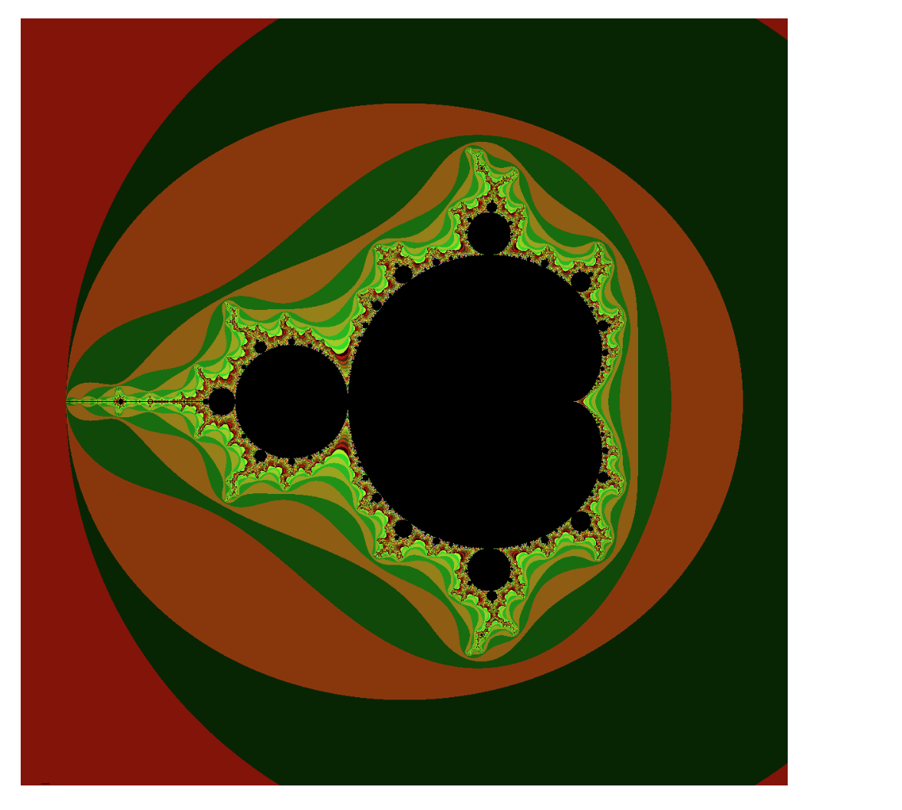

# CPPND: Capstone Mandelbrot

This project generates a self-similar Mandelbrot like sets according to specifications from user input. The options are quadratic Mandelbrot(https://en.wikipedia.org/wiki/Mandelbrot_set) or Mandelbar(https://en.wikipedia.org/wiki/Tricorn_(mathematics)) as well as Cubic parametrized and nonparametrized multibrot sets.

## Dependencies for Running Locally
* cmake >= 3.7
  * All OSes: [click here for installation instructions](https://cmake.org/install/)
* make >= 4.1 (Linux, Mac), 3.81 (Windows)
  * Linux: make is installed by default on most Linux distros
  * Mac: [install Xcode command line tools to get make](https://developer.apple.com/xcode/features/)
  * Windows: [Click here for installation instructions](http://gnuwin32.sourceforge.net/packages/make.htm)
* gcc/g++ >= 5.4
  * Linux: gcc / g++ is installed by default on most Linux distros
  * Mac: same deal as make - [install Xcode command line tools](https://developer.apple.com/xcode/features/)
  * Windows: recommend using [MinGW](http://www.mingw.org/)

Install [C++ FreeImage library](https://freeimage.sourceforge.io/).

## File Structure
The project consists of the following files:
- `frame.h` - defin a "window" class where  the image to be generated.
- `saveimage.cpp` - For ploting each pixel and saving  it to a file.
- `saveimage.h` - Header file for `saveimage.cpp`.
- `main.cpp` - The main program.

## Rubric Points
- **The project demonstrates an understanding of C++ functions and control structures.**  The `saveimage.cpp` and `main.cpp` files are divided into functions.  An `if-else if -else` statement is used in the `main() ` function in `main.cpp` as well as `void() ` function in `saveimage.cpp`.
- **The project reads data from a file and process the data, or the program writes data to a file.**  In `void plot()` in `saveimage.cpp`, the FreeImage library is used to write PNG files of the Mandelbrot set.
- **The project accepts user input and processes the input.**  In the `main()` function in `main.cpp`, users are asked a series of questions, like whether they want a quadratic or cubic. Also, they can enter the length of the image and also decide if the want to make a parametrized multibrot set.
- **The project uses OOP  and template techniques.**  In  `frame.h` , look at the  class `Window`.
- **Classes use appropriate public and private members.** 

## Basic Build Instructions
1. Clone the repo.
2. `mkdir build && cd build`
3. `cmake .. && make`
4. `./Capstone`.
5. Enter some info and parameter values.
6. Find the corresponding generated image in the `/build/` folder.
